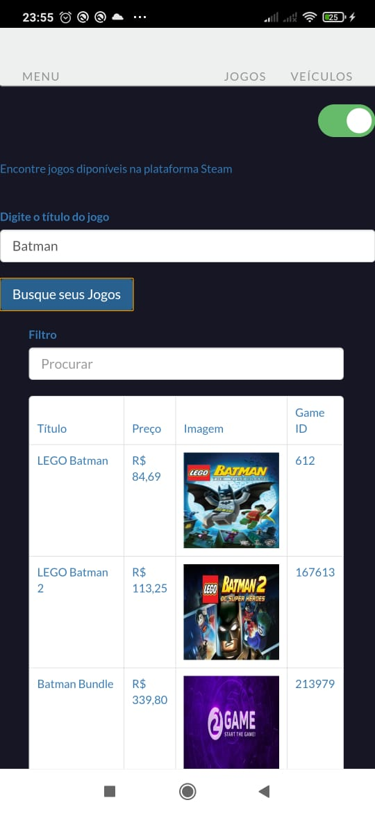
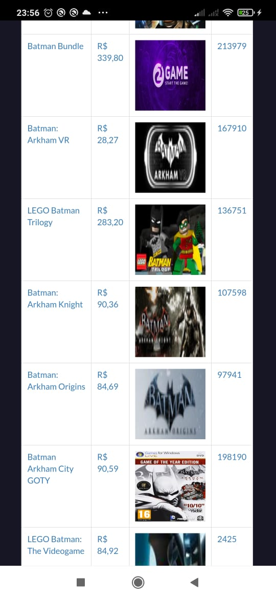
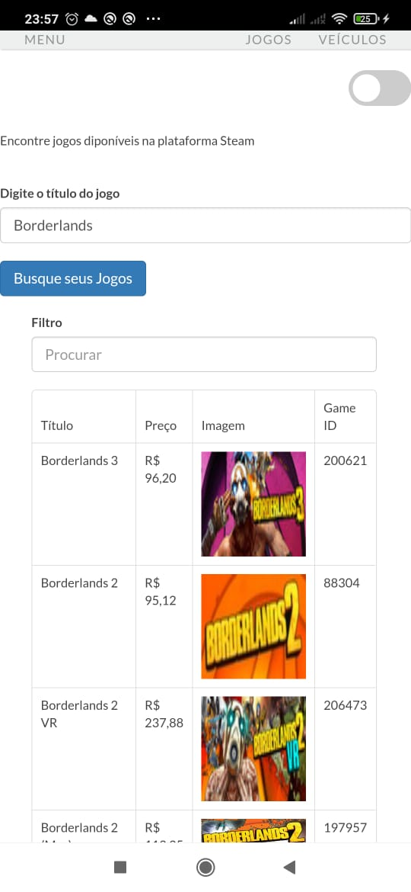
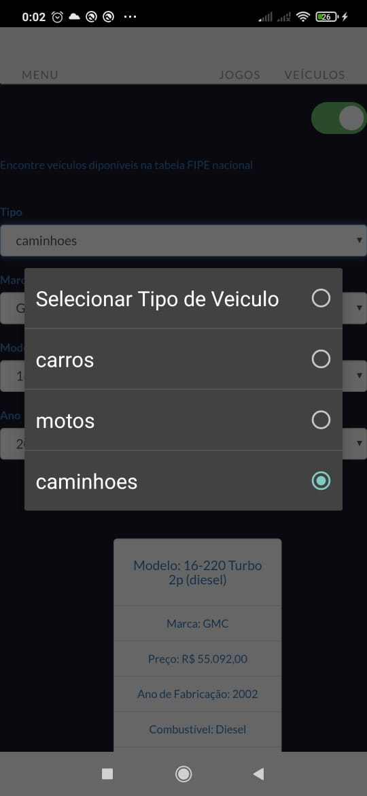
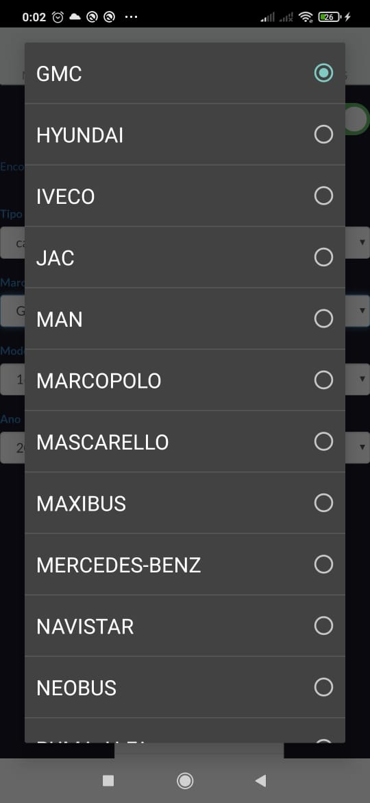
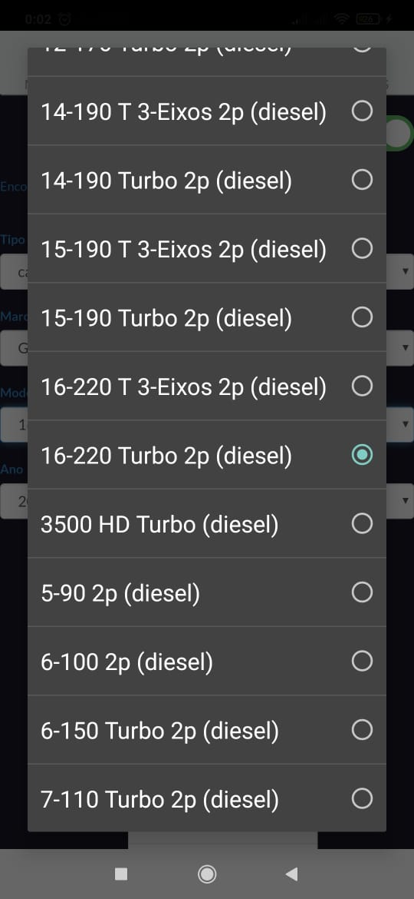
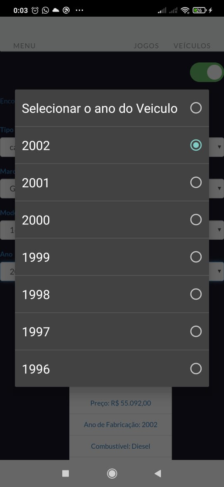
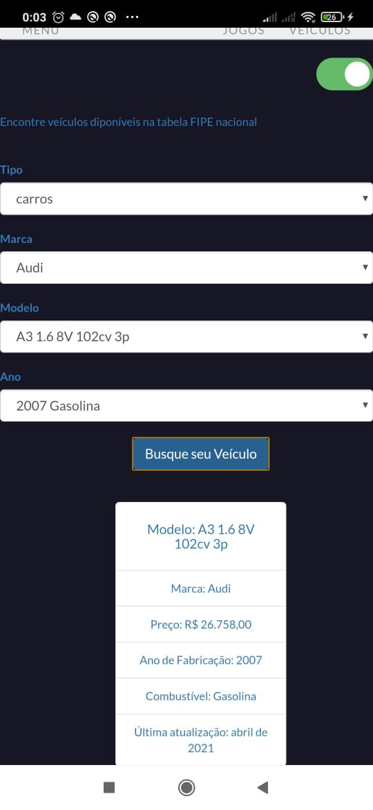
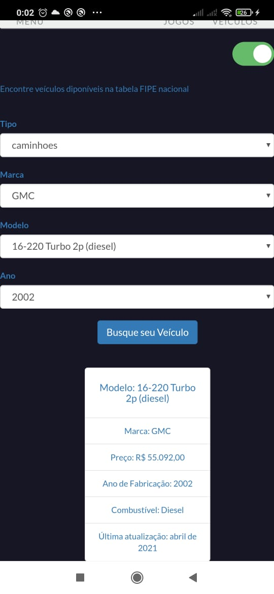

# ***Aplicação Find C&G N2 - Linguagem de Programação III***

***Descricão Geral***

Esse aplicativo tem como finalidade a busca de veículos(carros,motos e caminhoes) exibindo custo, tipo de combustivel,
ano de fabricação,marca e modelo de acordo com a tabela nacional FIPE.

E também a listagem de jogos de acordo com o título na loja virtual Steam, exibindo informações como: Preço(foi utilizada
uma outra API para converter o preço para R$), steam Id do jogo e a imagem usada como tema principal do jogo em questão.

***Instalação***

1. Para rodar a aplicação na sua máquina(browser) é necessario ter o ***Apache Cordova*** instalado.

   Segue o link com guia de instalação do Cordova ***[aqui](https://cordova.apache.org/#getstarted)***.

2. Para gerar o build para a plataforma Android é necessário ter o Android Studio instalado para geração do SDK e deve ser mapeado nas variáveis de ambiente.

   Segue o link de download do Android Studio ***[aqui](https://developer.android.com/studio)***.

3. É necessario ter o Java Development Kit instalada e mapeada nas variáveis de ambiente.

   Segue o link para download do JDK 8 ***[aqui](https://www.oracle.com/br/java/technologies/javase/javase-jdk8-downloads.html)***.

4. Para criar a aplicação(App) é necessário rodar no cmd do código fonte: "cordova create hello com.example.hello HelloWorld".

5. Para adicionar uma plataforma (módulo para o Android Studio) utilize o comando de acordo com a plataforma alvo: "cordova platform add android".
(Exemplo para Android) 

6. Para buildar a aplicação é possivel tanto pelo Android Studio pela aba Build do menu superior como pelo comando: "cordova build".

Dúvidas sobre outros comandos do Cordova está ***[aqui](https://cordova.apache.org/docs/en/3.1.0/guide/cli/)***.

***Detalhes***

A aplicação utiliza ***HTML5, CSS, JAVASCRIPT, JQUERY(3.6.0) E BOOTSTRAP(3.3.7)***, além da lib ***SWEET ALERT(1.0)*** para alertas.

***Integrantes***

Felipe Soares - 081180008

Lucas Caffer - 081180024

Milena Barbosa - 081180026

Pedro Carvalho - 081180028

***Evidências***

#### Listagem de Jogos

Jogos Batman

Jogos Batman 2

Jogos Borderlands

#### Listagem de Veiculos

Veiculos Tipo

Veiculos Marca

Veiculos Modelo

Veiculos Ano

Veiculos Tela Audi

Veiculos Tela Caminhão

